# FslSimpleUI

## Custom UI design

When designing a modern custom UI system you will need to consider at least the following:

* dpi awareness
* text rendering
* pixel perfect rendering
* performance

### Dpi awareness

#### Element size

A key aspect of any UI system designed to run on various displays is that you want to ensure that all buttons and text have a certain minimum size so that text can be read and buttons are big enough to press. Many existing UI systems rely on rendering items by their pixel size, which leads to varying physical sizes when rendered on screens with varying DPI.

These are the physical sizes of a item designed to be rendered on a 160dpi screen when rendered using pixels as size units.

80 dpi  | 160dpi | 640dpi
--------|--------|--------
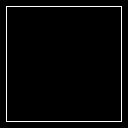||

Because of this many modern systems use a density independent abstraction that represents a physical size. This could be centimeters or inches but most systems decided to use a custom unit.

For example

UI system | Physical size| Density independent 'pixel'
----------|--------------|-----------------------------
[Android](https://material.io/design/layout/pixel-density.html#pixel-density-on-android) | 1/160 inch | 1dp at 160dpi is equal to one pixel, 1 dp at 640dpi is equal to four pixels.
[Wpf](https://docs.microsoft.com/en-us/dotnet/api/system.windows.frameworkelement.width?view=netcore-3.1)     | 1/96 inch  | 1px at 96dpi is qual to one pixel, 1px at 384dpi is equal to four pixels.

By representing the UI as having a physical size it will ensure that its elements are of the same physical size no matter what screen DPI you use it on.

These are the physical sizes of a item designed to be rendered on a 160dpi screen when rendered using a physical size unit.

80 dpi  | 160dpi | 640dpi
--------|--------|--------
||

While the actual physical sizes remains fixed, the actual physical pixels rendered are different.

#### Element scaling

Most UI systems rely on bitmap images in the UI but unfortunately bitmap images become blurred when scaled. So we need a strategy for rendering the element that tries to mitigate that problem.

Taking a native 160dpi image and scaling it up to higher DPI's lead to severely blurred images, the more you upscale it, the worse it looks. Taking a 640dpi native image and scaling it down to lower DPI's also leads to blurry images especially the smaller the image gets, but in general this will look nicer.

The first row is native 160dpi up-scaled, the second  is native 640dpi down-scaled and the third is native sized images.

Method|160 dpi | 320 dpi | 640 dpi
------|--------|---------|--------
Upscale||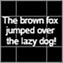|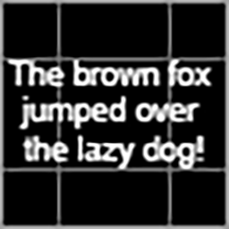
Downscale||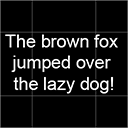|
Native|||

#### Animated example

The animation below shows native vs the given scaling algorithm.

Upscale bilinear | Upscale nearest | Downscale bilinear | Downscale nearest
-----------------|-----------------|--------------------|-------------------
 |  | 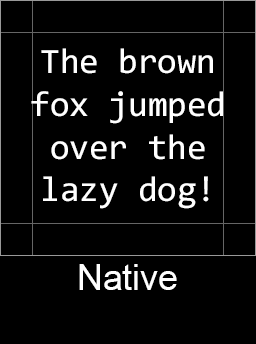 |  |

Lets zoom in a bit to make it even more clear

Upscale bilinear | Upscale nearest | Downscale bilinear | Downscale nearest
-----------------|-----------------|--------------------|-------------------
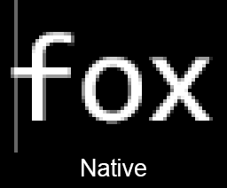 |  |  |  |


#### A strategy

So ideally a UI system needs to have multiple flavors of each image available to ensure that scaling will be minimal and often a 'downscale' will be the preferred choice.

The following example has 160, 320 and 640 dpi native flavors and then downscales the closest higher resolution to create the 240 and 480dpi rendering.

160 dpi | 240 dpi | 320 dpi | 480 dpi | 640 dpi
--------|---------|---------|---------|--------
||||

For target platforms that allow screens to be switched at runtime or allow the app to be moved between monitors we need to be able to switch between these various flavors at runtime to provide the optimal experience.

This strategy of using multiple flavors/resolution of a image closely resemble the strategy used by texture mipmaps.

#### Image design traps

While this strategy solves a lot of issues, you still need to be careful, when designing the images. For example the one pixel white lines used in the above example will probably look very thin on a 640dpi display and it could become blurry or disappear at various scaling levels. So better graphics would probably use around four pixels to represent the line as this should prevent it from disappearing when scaled and it will also make the 'physical' size the same, when compared to the 160dpi natively rendered version.

#### Device type / user distance

Finally a UI also needs to be aware of what type of device the UI is being rendered on. There is a huge difference between rendering something that is big enough to be read from a phone and the same UI being rendered on a TV with the user placed a couple of meters away.

### Text rendering

Text rendering is a very complicated topic, but even if we just stick to the basics there are a lot of things you need to be aware of. The most important part is once again to use a physical size for representing the text to ensure everything renders at the expected sizes.

Using vector graphics for rendering the actual text is the optimal solution since that ensures that it looks good no matter what DPI is being used. But for many platforms that is not a option and they instead rely on rendering bitmap fonts. Since the bitmap fonts are images, we can apply the same strategy of having multiple flavors of the font as we do with other images, which should keep the bitmap scaling issues at a minimum.

#### Bitmap vs SDF

A alternative choice is to use Signed Distance Field fonts (SDF) which scales a lot better and allows for various effects to be applied to the font.

2x scaled at 100% zoom | 2x scaled at 200% zoom
-----------------------|--------------
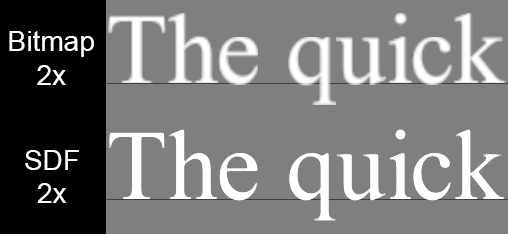|

The SDF fonts will appear 'sharp' in all resolutions, while the bitmap based one can be blurred.
The above bitmap/SDF example is a **worst case comparison** as it up-scales the font images which produces the worst looking images, if you have multiple resolutions of the bitmap font available, then the scaling will often be of the downscale variant and it should rarely be scaled by as much as 200%.


Rendering the actual font bitmaps with correct scaling and alignment to the font baseline is complex and all solutions have to make various sacrifices to ensure the rendered glyphs are as sharp as possible. The exact rendering and scaling issues will be examined closer in the "Pixel perfect rendering" section.

Examples                                                       | Description
---------------------------------------------------------------|-------------
[Vulkan.UI.DpiScale](../DemoApps/Vulkan/UI/DpiScale/README.md) | Pixel perfect bitmap font rendering.
[Vulkan.SdfFonts](../DemoApps/Vulkan/SdfFonts/README.md)       | SDF based font rendering.

### Pixel perfect rendering

Rendering images that starts or ends at sub pixel positions will produce slightly blurry output if rendered using a linear filter, and slightly incorrect looking images if rendered using a 'nearest' filter.

The image used in the following example is a checkerboard pattern of fully red and blue pixels created to make it easy to spot scaling and sub pixel rendering that cause blurriness or incorrect rendering. **Beware** to be able to see these examples correctly your document reader also need to handle images correctly. So the first image should be the correct output of the red/blue checkerboard pattern and the following three have slight errors caused by the linear filtering and sub pixel positions.

description| example
-----------|---------------------------------------------------
No Zoom    | 
200% zoom  | 

Due to the specific design of the image all errors tend to produce a magenta color due to the mixing of the red and blue colors. On a normal image it would just look blurry instead which is much harder to spot for many people.

While the blurriness can be mostly removed by using a 'nearest' texture filter vs a 'linear' one, the 'nearest' filter will still produce a less accurate image than one that actually deals with the issue of sub pixel precision to avoid the issue all together. In many cases where the image is actually intended to be scaled it also tend to look worse.

A good test to see how well a custom UI handles scaling and pixel precision issues when rendering at 1:1 resolution is to replace all graphics with a red/blue checkerboard pattern as any issues will be clearly visible (linear filtering should be used as well to make it easier to spot).

For good measure here is a animated comparison with native vs off by half a pixel in x (bilinear filtering).


#### Pixel perfect scaling

The main rule is to ensure that the resulting image starts and ends at a full pixel. However if you animate the scaling, it might look more fluid with sub pixel precision. So it is often a good idea to differentiate between fixed scaling for static content and scaling done for animation.

This also means that any UI element being scaled up/down because of the screen DPI should start and end at a full native pixel coordinate, even though it might produce a slightly smaller/larger end result. The benefit should be, that it will be less blurry and it will only be off by up to 1 pixel.

#### Pixel perfect bitmap font rendering

The same issue affects bitmap font based rendering. The following text for example is rendered at native resolution pixel correct and the second is off by 0.5 pixel (Texture 160dpi Scale 1.00)

Description   |Native                                                            |4x zoom
--------------|------------------------------------------------------------------|----------------------------------------------
Pixel Perfect |  |
Half pixel off||

The blurring on the 0.5 sub-pixel rendering is obvious.  


Scaling text strings rendered with bitmap fonts is a bit tricky. Just scaling everything according to a scale factor and rendering it with sub pixel precision will lead to blurry text as each individual char is an image and any image rendered at a sub pixel position becomes blurry. So a ideal solution will produce a rendering string that is roughly the same pixel size as the 'naive' solution, while making sure each individual character starts and ends on a full pixel boundary.

Texture 160dpi scale 0.8375

1. Naive scaling with glyphs at sub pixel positions.
2. Pixel perfect scaling all glyphs start and ends at pixel positions.

#|Native                                            |4x zoom
-|--------------------------------------------------|--------------------------------------------
1||
2||

The second solution provides a less blurry rendering of the font but the height of each individual glyph might be slightly off. But since that applies to all texting being rendered with that font at the given size, it will probably be unnoticeable by most people.  See ```Vulkan.UI.DpiScale``` for more details.

Here is an example animation of the basic scaling vs the pixel aware result:


#### Scrolling UI elements

As with animated scaling scrolling of ui elements can be done using sub pixel precision but it might cause flickering and blurriness. Try the ```Vulkan.UI.SmoothScroll``` example to get a better feeling for what fits your use case. If you need to have a very slow scroll speed on a low DPI display and your UI elements can handle it then sub pixel precision might be best.

But as a general recommendation for UI elements containing small details, it will probably be best to stick to per pixel scrolling.

#### Common traps

It is easy to accidentally render a UI element at a sub pixel position. For example by

* Working in density-independent pixels and converting them to a specific physical pixel coordinate without rounding it.
* Scrolling done with floating point based speeds.
* Scaling a image by a percentage can easily produce a sub pixel based size.
* Using floating points for element calculations and trying to center a element like this: ```(ScreenWidth - ElementWidth) / 2.0f```. Can easily produce a sub pixel coordinate.

#### Recommendation

* All UI control user facing values should be represented in density-independent pixels (dp).
  * This can easily be a floating point type.
* All internal rendering and layout should be done in integers and by using actual native pixels as coordinates and sizes.
  * The native pixel sizes should be calculated from their density-independent size and rounded nicely to fit on the native pixel grid.
* If sub pixel precision scrolling is desired for some reason, apply the scroll offset just before generating the triangles.
* Sub pixel precision makes most sense for low DPI displays and for certain kinds of scaling animations or some kind of scrolling.
* Process input gestures in density independent pixels. Convert the final positions to native pixels and send that in the events that target the UI controls, so the controls wont have to convert dp -> px to locate the touched window and similar.

This ensures that all elements will be rendered at pixel perfect positions and most calculations can be done in simple integers with no precision issues.

Examples                                                               | Description
-----------------------------------------------------------------------|-------------
[Vulkan.UI.DpiScale](../DemoApps/Vulkan/UI/DpiScale/README.md)         | Pixel perfect bitmap font rendering.
[Vulkan.UI.PixelPerfect](../DemoApps/Vulkan/UI/PixelPerfect/README.md) | Sub pixel offsets cause blurry images.
[Vulkan.UI.SmoothScroll](../DemoApps/Vulkan/UI/SmoothScroll/README.md) | Sub pixel scrolling issues.

### Performance

To get acceptable rendering performance

* Use texture atlases for the UI graphics.
* Use texture compression to save memory bandwidth.
* Batch as many draw operations together as possible.
* Take advantage of shaders to prevent overdraw.
* Utilize opaque rendering as much as possible to save memory bandwidth.

#### Take advantage of shaders

For example if you need to have a background image with a gradient overlay rendered on top like this:

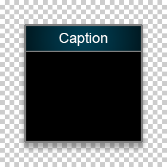

The easy way to render this is to:

1. Render the opaque background.
2. Render the transparent background (the dialog shadows etc).
3. Render the transparent gradient on top.
4. Render the transparent label.

Which is one opaque and three transparent draw operations. Here we can take advantage of shaders and combine the rendering of the background and the gradient overlay into one opaque rendering operation.

1. Render the opaque 'caption with gradient area'.
2. Render the rest of the opaque background.
3. Render the transparent background.
4. Render the transparent label.

This becomes two opaque and two transparent draw operations. But it comes with the tradeoff that we need to switch shaders during rendering.  So we unfortunately also went from having two draw calls to using three, which means that we need to do profiling to figure out whats most efficient for the given platform.

Another possibility would be to merge the background caption area mesh with the label mesh at runtime and thereby reducing the draw operations to:

1. Render the opaque 'caption with gradient area with no label'.
2. Render the opaque 'caption with gradient area with label'.
3. Render the rest of the opaque background.
4. Render the transparent background.

For this simple example it would probably not be worth it, but for more complex scenarios it could be.
The 'optimization' here has the nice advantage that all draw operation can use the same z-coordinate, so it suddenly becomes possible to render the window using a perspective transformation with full rotation support.  This is something that would normally require us to render the window to a offscreen texture before applying the result to a perspective rendered quad.  So we could save a lot of bandwidth with this optimization.  Basically we trade a extra shader switch and more complex mesh generation for rendering to a offscreen texture + rendering of the 3d quad. So in this case the optimization should be much faster on all GPU's. That being said the mesh generation code can become quite complex so if its worth the time to program really depends on your use case.

---

## Implementation deep dive

### Design choices

The FslSimpleUI follows the above recommendations.

* It uses multiple flavors of each texture atlas.
  * The basic theme has atlas flavors for: 80, 96, 160, 320, 480 and 640dpi.
* All UI control user facing values are represented in density-independent pixels. Just like Android we use "dp" as our unit.
* All internal rendering and layout are done in integers and use actual native pixels as coordinates and sizes.
  * All pixel sizes are calculated from their rounded 'dp' sizes.
* Sub pixel precision offsets can be applied to the final coordinates to allow for sub pixel precision, if so desired.
  * Currently none of the scroll controls utilize sub pixel precision.

The system is designed as a retained mode UI system and fully support both opaque and transparent materials.
However the current rendering implementation utilize batched immediate mode rendering.

### Event system

Events can be send using one of these routing strategies.

Routing strategy | description
-----------------|----------------
Direct           | Only the targeted window receive the event
Tunnel           | The event travel through all direct parents, starting at the root parent then moving closer and closer.
Bubble           | The event bubbles from the receiver through each direct parent
Paired           | The event is first tunneled as a preview then bubbled as a final event.

If we take this window hierarchy:

window hierarchy                                                   |
-------------------------------------------------------------------|
|

If the target is window G then.

Routing strategy | description
-----------------|----------------
Direct           | G receives the message as the only one
Tunnel           | The message is send to A->C->F->G
Bubble           | The message is send to G->F->C->A
Paired           | The message is send as a preview to A->C->F->G then to G->F->C->A

Furthermore we have two different event types

Type        | description
------------|----------------
Basic       | Simple event
Transaction | Transaction events will always have at least a begin and end event.

Transaction events are for example used for mouse clicks so that a mouse button press will send a WindowInputClickEvent with IsBegin==true when the event starts followed by a WindowInputClickEvent with IsBegin==false when the mouse button is released.

### Layout system

We utilize a simple two pass system, where all elements are first measured and then arranged.
During the measure phase each element is supplied with the available size from its parent and should return its desired pixel size. After the measuring completes all elements are arranged utilize their desired sizes to guide the layout.

It's a simple system that can handle most use cases fairly well.

Layout type       | Description
------------------|--------------------------
CanvasLayout      | Basically a manual layout that will be similar to using a old school specific position. This should rarely be used.
StackLayout       | Horizontal or vertical stack layout with optional spacing.
ComplexStackLayout| Horizontal or vertical stack with auto, star, dp or px sizes. This is basically a very light grid implementation for one row or column.
GridLayout        | Grid layout with support for cells sizes of auto, star, dp or px cell sizes.
WrapLayout        | Horizontal or vertical wrap layout with optional spacing. Will layout elements next to each other until the available size is used, then start a new row and continue there.

### Sprite system

To support complex UI rendering with custom shaders we utilize a material system.

The UI material system has two layers

* The SpriteMaterial which represents the rendering systems material types.
  * This normally contains information about the shaders and the textures needed by them.
  * Has information about transparency requirements.
* The higher level Sprite which contains at least one SpriteMaterial and represents a UI image concept.

#### SpriteMaterial

Represents low level information needed by the rendering system, which can be used to batch rendering calls properly.

#### Sprites

Is designed to represent image requirement concepts from the UI controls point of view.

Name                      | Concept
--------------------------|----------------------------------------------------------
BasicImageSprite          | An atlas image that does not utilize trim.
ImageSprite               | An atlas image that can contain trimmed images.
BasicNineSliceSprite      | An atlas image representing a nine slice without trim.
NineSliceSprite           | An atlas image representing a nine slice that can contain a bit of trim outside the scaling areas.
PatchImageSprite          | An atlas image that represents a patch image.

Having these Sprite concepts allows us to design UI controls that

* are very explicit about the requirements they place on their 'graphics' resources.
* receive all the necessary 'content-configuration' in one object.

furthermore it allows us to validate the user supplied information at creation time and in their full context.

#### Image concepts

##### Trim

Trims transparent pixels from the sprites border and shrink the image size, which allows for tighter texture atlas packing and speeds up rendering, as we do not waste processing power rendering fully transparent pixels.

Untrimmed | Trim margin 0 | Trim margin 1 | Trim margin 2
----------|---------------|---------------|----------------------------
||||

For size and rendering purposes there are generally no difference between the rendered result of a trimmed or non-trimmed image, since the atlas contains information about the number of trimmed pixels. We take that into account during rendering. However using a trim margin of zero could lead to slightly different rendering results between a trimmed and non-trimmed image.  

The rendering of a trimmed image is just slightly more complicated as we need to take the number of trimmed pixels into account for both positioning and scaling. This is why we have both BasicImageSprites and ImageSprites, which allows for a control to simplify its calculations by only operating on images without trim.

It's very important to calculate the x+y scale factors for "trim offset + trimmed image size" based on the scaled and rounded full image size and both the "trimOffset + trimmedSize" needs to be done in floats to ensure we have the correct precision.

##### NineSlice / NinePatch

A nine-slice AKA nine-patch is a simple strategy for specifying which areas of a image to scale. It is commonly used to render window backgrounds.

A nine patch is divided into nine regions:

Regions | Source image | Scaling slices | Content slices
--------|--------------|----------------|----------------------
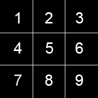|||


The scaling slices specify what will be scaled and what will remain a fixed size. 

.             |No scale | Scaling | No scaling
--------------|---------|---------|--------------
**No scaling**| 1       | 2       | 3
**Scaling**   | 4       | 5       | 6
**No scaling**| 7       | 8       | 9


So regions 1, 3, 7 and 9 will never be scaled.
Region 2 and 8 will be scaled in width but remain fixed in height.
Region 4 and 6 will remain fixed in width and scaled in height.
Region 5 will be scaled in both width and height.

The content slices specify where content can be placed on the nine slice image. The content will be placed inside region 5.

Normal image scaling vs nine-slice based scaling

Unscaled image | 2x scaled | NineSlice 2x scaled
---------------|-----------|--------------------
||


A nine slice can be represented by two simple thickness structures. One for the scaling slices and one for the content slices.

Thickness member | description
-----------------|--------------------------------------------------
Left             | The location of the first x slice from x=0.
Right            | The location of the second x slice from x=imageWidth-1.
Top              | The location of the first y slice from y=0.
Bottom           | The location of the second y slice from y=imageHeight-1.

##### N-Patch

This is basically just a more flexible version of the nine-patch scheme. Using a n-patch you can specify N number of patches and for each region you can specify how it should be scaled.

N-Patch is flexible in the way you can specify N vertical slices and M horizontal slices depending on your needs. It also allows you to specify X content regions.

Source image | Scaling slices | Content slices
-------------|----------------|----------------------
|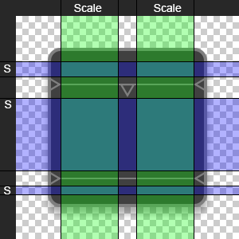|

One simple way to define the patch is to use the Android ".9" scheme as specified [here](https://developer.android.com/studio/write/draw9patch).

Basically a extra border line is added around the source image.  The left and top lines are used to specify the scaling areas. The right and bottom line specify the content/fill areas.

Source Image | Source '.9' image | Slices
-------------|-------------------|----------------
|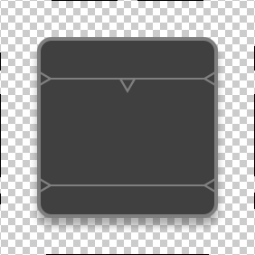|
